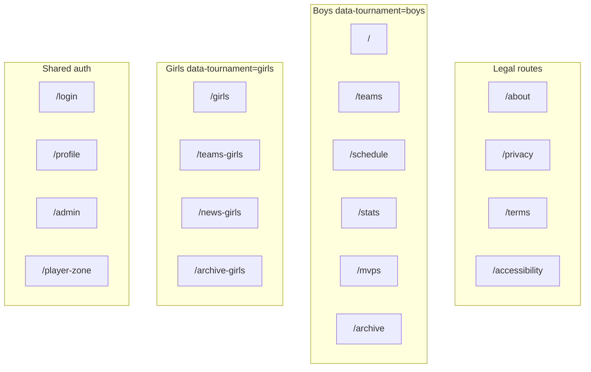
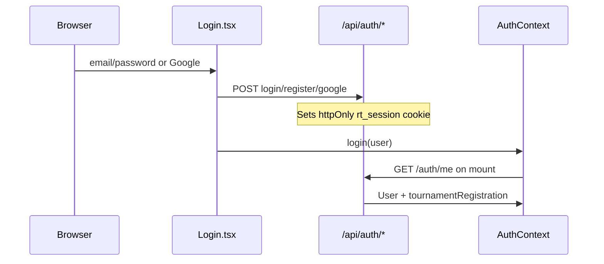
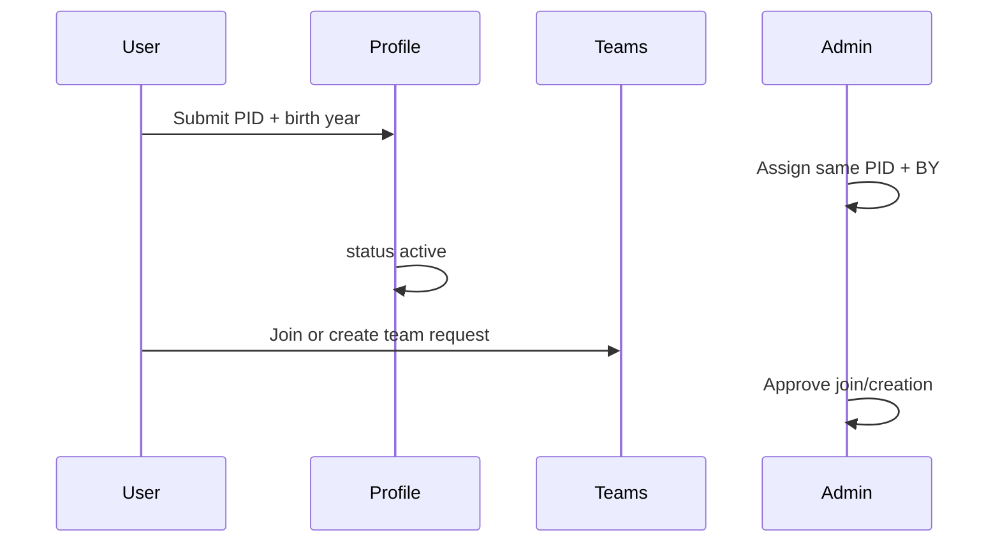

# Client Architecture

Audience: frontend developers and agents working in `client/`.

**Stack:** React 19, Vite 7, React Router 7, TypeScript, Bootstrap 5, axios with `withCredentials`.

**Upstream:** [`context.md`](../../context.md) (repo-wide), [`docs/server/API_REFERENCE.md`](../server/API_REFERENCE.md) (API contracts), [`docs/server/BUSINESS_LOGIC.md`](../server/BUSINESS_LOGIC.md) (registration rules).

---

## Route map

Source of truth: [`client/src/App.tsx`](../../client/src/App.tsx).

### Tournament shell (`AppShell`)

| Area | Paths | Notes |
|------|-------|-------|
| Boys (default) | `/`, `/teams`, `/schedule`, `/stats`, `/mvps`, `/archive` | `data-tournament="boys"` |
| Girls | `/girls`, `/teams-girls`, `/news-girls`, `/archive-girls` | No schedule/MVP routes |
| World Cup | `/world-cup`, `/world-cup/teams`, `/world-cup/schedule`, `/world-cup/stats` | Flag-gated; see [`docs/review/world-cup-phase.md`](../review/world-cup-phase.md) |
| Auth / account | `/login`, `/admin/login`, `/profile`, `/admin` | `noindex` SEO |
| Player zone | `/player-zone` | Separate session cookie (`rt_player`) |

### Legal (no tournament chrome)

`/about`, `/privacy`, `/terms`, `/accessibility` — `LegalPageLayout`, prerendered at build.

---

## App shell and navigation

- **Layout:** `AppShell` (header, news banner, `app-body` grid, footer) vs `LegalPageLayout` for legal pages.
- **Breakpoint:** JS (`useMediaMobile` in [`useSidebarDrawer.ts`](../../client/src/hooks/useSidebarDrawer.ts)) and CSS share `(max-width: 768px)`.
- **Desktop:** sticky right sidebar ([`TournamentSidebar`](../../client/src/components/TournamentSidebar.tsx)) with full [`getMainNavItems`](../../client/src/utils/mainNavItems.ts).
- **Mobile:** permanent bottom bar ([`MobileBottomNav`](../../client/src/components/MobileBottomNav.tsx)) — Home → Teams → Schedule/Archive → Stats (boys/WC) → Profile (girls: four tabs; news stays in [`NewsBanner`](../../client/src/components/NewsBanner.tsx)). Thin fixed header band: tournament switcher | title | hamburger. Drawer is overflow-only via `filterMobileOverflowNavItems` / `getMobilePrimaryNavItems`. Profile tab shows `user.avatarUrl`; admins get a Profile/Admin chooser. Tab tap scrolls to top (`prefers-reduced-motion` → `auto`); ScrollToTop is hidden. Swipe left on `#main-content` still opens the drawer.
- **Tournament context:** [`TournamentContext`](../../client/src/contexts/TournamentContext.tsx) — slug, `data-tournament`, season switcher.
- **Themes:** [`tokens.css`](../../client/src/styles/tokens.css) (boys), [`tournament-girls.css`](../../client/src/styles/tournament-girls.css), [`tournament-worldcup.css`](../../client/src/styles/tournament-worldcup.css).

---

## Authentication (Layer 1 — website account)

Two **independent** sessions: website (`rt_session`) and player zone (`rt_player`).

| Piece | File |
|-------|------|
| Login UI | [`Login.tsx`](../../client/src/pages/admin/Login.tsx) — register → email OTP → login; Google OAuth |
| Session state | [`AuthContext.tsx`](../../client/src/contexts/AuthContext.tsx) — `user`, `loading`, `refreshUser()`, `logout()`; 401 clears user |
| API client | [`authAPI`](../../client/src/api/client.ts) — login, register, google, verify-email, logout, me |
| Dev proxy | Relative `/api` + Vite proxy; prod `VITE_API_URL` |

Public pages work without login. `/profile` and registration actions require login (redirect to `/login`).

---

## Tournament registration (Layer 2 — per season)

Personal ID + birth year symmetric flow (Jun 2026). Labels from [`shared/registrationStatus.ts`](../../shared/registrationStatus.ts).

| Status | Meaning | Client UI |
|--------|---------|-----------|
| `none` | No identity submitted | Profile identity form |
| `awaiting_identity` | User submitted; admin has not | Banner + form (self-correction) |
| `identity_assigned` | Admin entered; user must match | Profile form to activate |
| `active` | Identity matched | Join/create enabled on Teams |
| `join_pending` | Request in flight | Status text + cancel button |
| `archived` | Season ended | Read-only label |

**Key UI files:**

- [`TournamentRegistrationCard.tsx`](../../client/src/components/profile/TournamentRegistrationCard.tsx) — identity form, status, pending request cancel
- [`TeamRegistrationActions.tsx`](../../client/src/components/registration/TeamRegistrationActions.tsx) — join/create (gated on `active`)
- [`RegistrationWorkflowAdmin.tsx`](../../client/src/components/admin/RegistrationWorkflowAdmin.tsx) — admin identity assign + queues

**Business rules:**

- One pending request per user per season (join **or** creation)
- Join/creation blocked until `status === 'active'`
- Boys OR girls only (`activeDivision`); API enforces
- `invoiceAlert` field name is legacy — displays Hebrew mismatch warnings
- Rate limit: 3 failed identity attempts/day (server; user sees API error)

---

## Roles and permissions

Source: [`tournamentUser.ts`](../../client/src/utils/tournamentUser.ts) + `AuthContext` types.

| Role | How determined | Client capabilities |
|------|----------------|---------------------|
| Platform admin | `isPlatformAdmin` / DB `admin` | `/admin` panel, roster add/delete, workflows |
| PRD team owner | `ownedTeamId` on registration; `Player.isTeamOwner` on roster API | `TeamOwnerSettings` branding; **join review** (final approve, no admin); roster **post-edit** (`RosterPlayerEditModal`); Profile badge **בעלים** / **בעלים וקפטן** (light-blue star, or gold + blue outline when still squad captain) |
| PRD squad captain | `onRoster.isCaptain` / `Player.isCaptain` | `OwnerSquadRoles` (with owner); claimed captains get `TeamOwnerSettings` + **join review** (final) + roster **post-edit**; Profile badge **קפטן** (gold star); Teams player-card star |
| PRD player | `onRoster` without captain | Profile self-edit (captain/owner may overwrite), transfer request |
| Legacy captain/player | `mappedPlayerInfo` (shrinking) | Legacy panels until fully retired |
| Anonymous | no `rt_session` | Browse public; comment (if allowed) |

Star variants are shared via [`TournamentRoleStar`](../../client/src/components/TournamentRoleStar.tsx) and [`getRoleStarVariant`](../../client/src/utils/tournamentUser.ts): **captain** = gold; **owner-captain** = gold + light-blue stroke; **owner-only** = light-blue.

Platform admin role is **not** overwritten by roster state in `/auth/me` (Jun 2026). `canAccessAdminPanel` = platform admin only. **Owner or claimed captain** finalizes joins on Profile/Teams (`pending` → `approved`); admin only sees joins when the team has **neither** (`owner_approved` queue). Claimed players keep Profile self-edit; owner/captain may post-edit any teammate (last write wins).

---

## Player zone (separate auth)

[`PlayerZone.tsx`](../../client/src/pages/PlayerZone.tsx) — PID + birth year → `playerAPI.login` → `rt_player` cookie. Photo upload flow; unrelated to website `AuthContext`.

---

## API client index

Detail in [`docs/server/API_REFERENCE.md`](../server/API_REFERENCE.md).

| Module | Prefix / scope |
|--------|----------------|
| `authAPI` | `/auth/*` |
| `usersAPI` | `/users/*` — registration, verify-identity, avatar, profile |
| `registrationAPI` | `/teams*` — join, creation, transfer, owner review |
| `teamsAPI` | Public teams + admin roster mutations |
| `adminAPI` | `/admin/*` — workflows, identity, seasons, automation |
| `playerAPI` | `/players/*` — player-zone session |
| `statsAPI` / `statsGirlsAPI` | Boys / girls stats |
| `votesAPI` | MVP votes (boys players / girls teams) |
| `worldcupAPI` | `/worldcup/*` |

---

## Related docs

- Accessibility: [`.cursor/rules/israeli-accessibility-is5568.mdc`](../../.cursor/rules/israeli-accessibility-is5568.mdc), [`docs/review/is-5568-wcag-aa-pass-may-2026.md`](../review/is-5568-wcag-aa-pass-may-2026.md)
- QA traceability: [`docs/review/phase-2-rtm-qa-may-2026.md`](../review/phase-2-rtm-qa-may-2026.md)
- Manual smoke checklist: [`status.md`](../../status.md) (Personal ID registration section)
