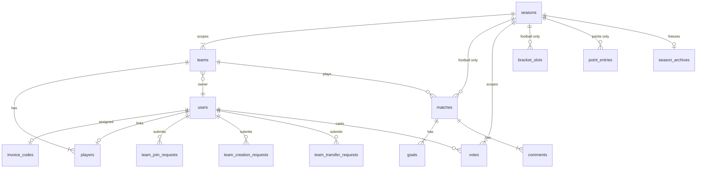
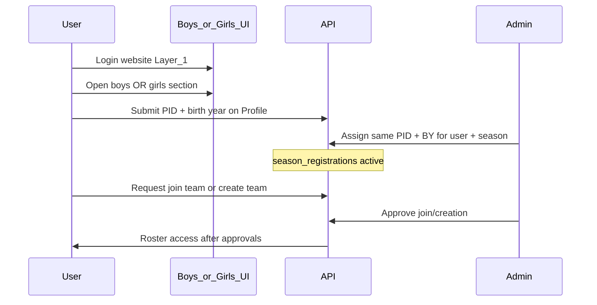

# PRD: Ramadan Tournament — Relational Database Schema

**Version:** 0.10  
**Status:** PRD complete — two-layer registration (§16) locked; identity gate (Jun 2026)  
**Related plans:** Postgres+Redis migration, Player registration workflows (Phase 2)

---

## 1. Purpose

Define a **complete, normalized PostgreSQL schema** so that no feature lacks a table, constraints match business rules, and the design follows relational best practice (ER model, FKs, indexes).

**Single source of truth** before Prisma migrations.

---

## 2. Scope

### In scope

Identity gate (personal ID + birth year), teams/roster/owner, workflows, **football** (matches/goals/bracket/lineup) and **points** (point_entries standings), news, comments, votes, stats snapshots, archives, banned words, photos, Redis cache.

### Removed / deferred (per your answers)

| Item | Decision |
|------|----------|
| `iftar_times` / Iftar API | **Remove** from DB and product |
| `alarms` JSON table | **Deferred** — future live alert relay, not current JSON feed |
| `audit_log` | Out of scope unless added later |

### Parallel tournaments (boys + girls) — different game formats

Multiple tournaments **in one calendar year** via `seasons.division` (e.g. `boys`, `girls`).  
`seasons` unique on `(year_month, division)`.

| Division (example) | `seasons.scoring_mode` | Competition model |
|--------------------|------------------------|-------------------|
| Boys (football) | `football` | Matches, goals, brackets, W/D/L standings, squad roles (5+GK) |
| Girls | `points` | **Not football** — teams earn **points**; **highest total wins**; no goals/bracket/lineup |

Shared per `season_id`: teams, roster workflows, identity verification, votes (MVP may differ for points seasons — see §6.G).

**Girls / points seasons do not use:** `matches`, `goals`, `bracket_slots`, or `players.squad_role` lineup rules.

**UX (locked):** Boys football and girls points are **separate main experiences** — not one shared homepage. See **§15**.

---

## 3. Design principles

1. Surrogate **UUID** for `users`; **integer** `id` for `teams`, `matches`, `news` (seed-compatible).
2. Explicit **FK + ON DELETE** (documented in §6).
3. **Global unique** `players.member_id`.
4. **JSONB** only for `stats_snapshots` and `season_archives` bulk history.
5. **Encrypt** `players.personal_id` at application layer before store.
6. Identity wrong-attempt rate limit in **Redis only** (3/day; lock until next calendar day Asia/Jerusalem).

---

## 4. ER overview



---

## 5. Final table list (Phase 1 migration)

| Table | PK | Notes |
|-------|-----|-------|
| `seasons` | `id` | `year_month`, `division`, `display_name`, `is_active`, **`scoring_mode`** (`football` \| `points`); UNIQUE(year_month, division) |
| `point_entries` | UUID | **Points seasons only:** `season_id`, `team_id`, `points` (delta), `note`, `recorded_at`, `recorded_by` (admin) |
| `users` | UUID | auth, `role` (`admin`\|`user`), `registration_status` (`user`\|`player`), team link columns |
| `invoice_codes` | UUID | **Legacy / historical only** — superseded by encrypted PID on `season_registrations` (Jun 2026) |
| `season_registrations` | UUID | `user_id`, `season_id`, `division`, encrypted PID columns, birth years, status — UNIQUE(`user_id`, `season_id`); enforce one division per user per `year_month` |
| `form_prereg_entries` | UUID | **Jun 2026:** Google Form CSV import per `season_id`; encrypted `personal_id_enc`, `birth_year`, optional `captain_email`; replace-all via `npm run import:prereg` |
| `teams` | INT | `season_id`, `owner_user_id`, name, logo, `status` |
| `players` | `member_id` INT global | `team_id`, `user_id` **required**, jersey `number`, `squad_role`, photos, `personal_id` encrypted, `active` |
| `team_creation_requests` | UUID | |
| `team_join_requests` | UUID | two-step owner → admin |
| `team_transfer_requests` | UUID | |
| `matches` | INT | **Football seasons only** — `season_id`, teams, scores, `timestamptz` |
| `goals` | UUID | **Football only** — `match_id`, `member_id`, `minute`, `is_own_goal` |
| `bracket_slots` | UUID | **Football only** |
| `news` | INT | **`season_id` required** — post belongs to football or girls season |
| `comments` | UUID | anonymous `author` string |
| `votes` | UUID | Football: `player_member_id`; Girls: `team_id`; UNIQUE(user_id, season_id, category) |
| `stats_snapshots` | UUID | JSONB, `season_id`, unlimited history |
| `season_archives` | `year_month` + `division` | JSONB payloads |
| `banned_words` | UUID | word UNIQUE, case-insensitive match in app |

**Not created:** `iftar_times`, `alarms`, `player_photo_requests` (use `players.pending_head_photo`).

---

## 6. Locked business rules (from §12 answers)

### A. Seasons & teams

| Rule | Detail |
|------|--------|
| Multiple tournaments / year | Yes — `seasons.division` + **`scoring_mode`** |
| Same category, same month | **Not allowed** — UNIQUE(`year_month`, `division`); e.g. no two football seasons in the same month |
| Same person, boys **and** girls | **No** — a participant is **either** in the boys tournament **or** the girls tournament, never both. Boys and girls do not share teams or rosters. |
| Girls season start | **Manual admin** creates/activates girls `seasons` row (not auto on deploy) |
| Boys / football | Matches, goals, bracket, football standings, 5+GK lineup |
| Girls / points | **`point_entries`** only; standings = **SUM(points) BY team**, descending |
| `season_id` on | `teams`, `votes`, `stats_snapshots`, + football or points child tables |
| Season end | **Same team rows** next season; new `season_id`; transfers move players |
| Archive | **Manual admin**; votes reset **after** archive |
| Archive PK | `(year_month, division)` composite |

### A.1 Points game (girls) — rules

| Rule | Detail |
|------|--------|
| Scoring | **Admin only** records **point_entries**; **negative deltas allowed** (correct errors) |
| Standings | `team_total = SUM(point_entries.points)` for season; rank by total DESC |
| Winner | **Top points** at season end (no knockout) |
| UI | Separate standings view or tab filtered by `season_id` / division |
| Stats automation | Snapshot compares **points standings**, not goals (branch on `scoring_mode`) |
| Comments | Optional: no match comments for points season unless tied to a generic “event” later |

### B. Two layers: website account vs tournament (see §16)

| Layer | What | Table(s) |
|-------|------|----------|
| **1. Website** | Login (Google / email OTP) | `users` only — **not** a tournament player yet |
| **2. Tournament** | Boys **or** girls season; identity + join workflows | `season_registrations`, requests, `players` |

| Field | Values | Purpose |
|-------|--------|---------|
| `users.role` | `admin` \| `user` | Platform only |
| `users.active_division` | `boys` \| `girls` \| null | Set on **first join/create request** on that side for the active `year_month` — **locks** boys OR girls for the year |
| `season_registrations.status` | see §16 | Tracks identity match + eligibility per `season_id` |
| Cross-division | **Forbidden** | One person cannot play boys and girls |

Legacy `Captain` / `Player` roles are **dropped**; tournament state lives in `season_registrations` + roster.

### C. Identity gate (tournament layer only) — Jun 2026

| Rule | Detail |
|------|--------|
| Gate | **Personal ID (תעודת זהות) + birth year** — symmetric user-first or admin-first flow |
| User submit | `POST /api/users/verify-identity` — encrypted storage on `season_registrations` |
| Admin assign | `POST /api/admin/users/identity` — admin enters same PID + BY from offline records |
| Match | `active` only when encrypted user ID and admin ID match **and** birth years match |
| Display | Admin UI shows **masked** user ID (last 4 digits); full PID never in JSON |
| Brute force | **3** wrong attempts/day → locked until **next calendar day** (Asia/Jerusalem); **Redis** `rt:identity:attempts:*` |
| Legacy | **`invoice_codes`** table retained for historical rows only; see §16.1 |

Join approval (owner → admin) may proceed in parallel, but **roster / full player features** require `season_registrations.status = active` (identity matched).

<details>
<summary>Historical: invoice gate (v0.6–0.9, retired Jun 2026)</summary>

Original design used alphanumeric invoice codes (`invoice_codes.code_hash`), admin assign + user redeem on profile. Replaced by personal ID + birth year verification.
</details>

### D. Roster & lineup

| Rule | Detail |
|------|--------|
| `member_id` | Globally unique |
| Roster size | **No max** |
| Match validity | **Football only:** team needs **≥ 6 players** on roster to play a match |
| Starting lineup | Max **5 outfield + 1 GK** — **`scoring_mode = football` only** |
| Jersey numbers | **UNIQUE per team** |
| Roster players | **Must** have `user_id` — no manual-only ghosts |
| Team creation approved | Team row + **owner on roster immediately** |
| Bench | `squad_role IS NULL` |

### E. Requests

| Rule | Detail |
|------|--------|
| Join | User on **boys pages** or **`-girls` pages`** submits request → sets `active_division` if null |
| Join | Owner approve → admin final approve (can be pending while awaiting identity match) |
| Multi join | Second pending request **invalidates all** pending |
| Rejected join | Can request **another team immediately**; **same team after 1 day** |
| Transfer | **Any** team; target may decline via reject |

### F. Matches & goals

| Rule | Detail |
|------|--------|
| Time | `timestamptz`, **Asia/Jerusalem**; store **goal `minute`** |
| Scores | `NULL` = not played; **0 not used as forfeit**; live score e.g. 1–0 while in progress |
| Scorer | Must be on **either team’s roster**; **`is_own_goal`** flag supported |
| Bracket | `bracket_slots` synced with knockout matches |

### G. Comments & votes (Q25–26 clarified)

**Comments:** Anonymous display name string; **delete only**. Match comments only for **football** seasons (FK `match_id`).

**Votes (MVP):**

- Each logged-in user casts **one vote per category per season** (e.g. category `mvp`).
- Vote stores `player_member_id` — must be on a roster **in that season**.
- **Football:** player MVP (`player_member_id`).
- **Points (girls):** **team vote** — `votes.team_id` (nullable FK); UNIQUE(user_id, season_id, category); no player MVP on girls.
- **Reset when season is archived**.

### H. Photos & PII

| Rule | Detail |
|------|--------|
| `personal_id` | Encrypted at rest |
| Pending photo | `players.pending_head_photo` URL; files on disk/Git deploy path |
| Delete photo | Clear URL in DB; file cleanup optional; **compress uploads** anti-abuse |

### I. Stats & news

| Rule | Detail |
|------|--------|
| `stats_snapshots` | **Unlimited** history |
| `news.id` | **Integer** (continue max+1 from seed) |

### J. Moderation

**Banned words (Q37 clarified):** Store lowercase normalized Hebrew; match **case-insensitive**; optional normalization of final letters (ך→כ) in application code — not DB-level.

### K. Deletion (Q38, Q40 — recommendations accepted)

| Action | Policy |
|--------|--------|
| Delete **team** | **RESTRICT** if any `matches` or `players` reference it — admin must remove/archive first. Explain to admin: “לא ניתן למחוק קבוצה עם משחקים רשומים.” |
| Delete **user** | Comments already anonymous — no FK. **SET NULL** on `votes` / orphan handling, or block delete if vote exists. **Soft-disable** user (`active=false`) preferred over hard delete. |
| Remove from **roster** | **Soft-delete:** `players.active=false`, keep row for stats/history |

---

## 7. `team_join_requests` status machine

```
pending → owner_approved → approved (admin)
        ↘ rejected (owner or admin)
        ↘ invalidated (multi-request rule)
```

Columns: `owner_reviewed_at/by`, `admin_reviewed_at/by`, optional `same_team_retry_after` for 1-day cooldown.

---

## 8. Constraints summary

```sql
-- Examples for Prisma/raw SQL
UNIQUE (year_month, division) ON seasons;
UNIQUE (team_id, number) ON players WHERE active = true;
UNIQUE (user_id, season_id, category) ON votes;
UNIQUE (team_id) WHERE squad_role = 'captain' AND squad_role IS NOT NULL; -- partial
-- One pending join per user: partial unique on (user_id) WHERE status IN ('pending','owner_approved')
```

---

## 9. Redis vs Postgres

Unchanged: authoritative data in Postgres; `rt:doc:*` cache in Redis; invoice attempt counters in Redis with TTL to midnight Asia/Jerusalem.

---

## 10. Seed mapping

| File | Tables |
|------|--------|
| `data/teams.json` | `seasons` (default boys 2026), `teams`, `players` |
| `data/matches.json` | `matches`, `goals` |
| `data/news.json` | `news` |
| `data/bracket.json` | `bracket_slots` |
| `data/standings.json` | optional `stats_snapshots` |

**Remove:** iftar seed. **No seed:** users except admin, votes, comments.

---

## 11. Phase delivery

| Phase 1 | Phase 2 |
|---------|---------|
| All tables + seed (boys football) | Invoice, requests, owner lineup (football) |
| Redis required | Points admin UI + girls `seasons` row |
| Drop Iftar | `scoring_mode` branches in stats API |

---

## 16. Two-layer registration flow (locked)

### Layer 1 — Website registration

- User **signs up / logs in** (OAuth or email + OTP).
- Row in **`users`** only.
- Can browse public content; **not** on a tournament roster yet.
- **Single database** for all accounts.

### Layer 2 — Tournament registration (per season, one division)

User must use the **correct side** of the site (boys routes vs `-girls` routes).  
**Boys and girls are separate tournaments** — same person never both.

**Identity gate:** Admin or user enters **תעודת זהות + שנת לידה** first; the other side enters matching values; `active` only when encrypted ID and birth year match on both columns.



| Step | Who | Action |
|------|-----|--------|
| 1 | User | Log in (website) |
| 2 | User | Open **boys** (`/teams`, …) **or** **girls** (`/teams-girls`, …) — not both for playing |
| 3 | User **or** Admin | Enter **personal ID + birth year** (symmetric — either side first) |
| 4 | Other side | Enter **matching** PID + birth year |
| 5 | System | `season_registrations.status = active` when encrypted IDs and birth years match |
| 6 | User | **Request to join** (or request new team) — requires `active` |
| 7 | Admin | Approve join/creation (owner may approve join first) |

### `season_registrations` status machine

| Status | Meaning |
|--------|---------|
| `none` | No identity submitted this season |
| `join_pending` | Join/create request in flight |
| `awaiting_identity` | User submitted PID+BY; admin has not assigned |
| `identity_assigned` | Admin assigned; user must match on Profile |
| `active` | Identity matched — eligible for join/create and roster |
| `archived` | Season ended |

**UI hints:**

- Before identity match: Profile shows identity form; Teams join/create disabled until `active`.
- Wrong division: block join API if `active_division` conflicts with request season’s division.
- Mismatch: `invoiceAlert` column stores Hebrew warning text (legacy column name).

### Admin panel (tournament)

- Filter by season (boys / girls).
- Queue: join requests + users **awaiting identity assignment** (`RegistrationWorkflowAdmin`).
- Action: **Assign identity** — admin enters full PID + birth year from offline records; user sees masked ID in queue.
- Cannot assign boys identity to user locked to girls division.

### Database (single `users`, split tournaments)

- **`users`** — one row per person (website).
- **`seasons`** — boys season vs girls season (`division`, `scoring_mode`).
- **`season_registrations`** — `(user_id, season_id)` + status + encrypted PID columns + birth years.
- **`team_join_requests`** / **`team_creation_requests`** — reference `season_id`; division must match `active_division`.

### 16.1 Identity gate migration — Jun 2026

| Topic | Detail |
|-------|--------|
| Change | Replaced payment-receipt / invoice redeem with personal ID + birth year |
| APIs | `POST /api/users/verify-identity`, `POST /api/admin/users/identity` |
| Retired routes | `/redeem-invoice`, `/admin/users/invoice`, `/map-player` |
| `invoice_codes` | Table retained for historical rows; **not written** for new registrations |
| `invoiceAlert` | Column name kept; stores Hebrew identity mismatch messages |
| Rate limit | `IdentityRateLimitService` — 3/day (was 5/day invoice attempts) |
| Canonical docs | [`docs/server/BUSINESS_LOGIC.md`](../server/BUSINESS_LOGIC.md) |

Historical note: v0.6–0.9 used alphanumeric invoice codes; see collapsed section in §6.C.

### 16.2 Jun 2026 additions (nav + prereg)

| Feature | Detail |
|---------|--------|
| Form prereg | `form_prereg_entries` + `PreregistrationLookupService.evaluate` — full ID+BY match auto-activates; partial/mismatch → email + `invoiceAlert` |
| Nav indicators | `GET /admin/workflows/pending-count`; `ownerPendingJoinCount` on `/auth/me` registration summary; client red dots on Profile/Admin links |
| Claim banner | `GET /teams/has-claimable-players` — hide dashboard/profile claim prompts when no claimable slots |
| Owner vs captain | Team **owner** (`ownerUserId`) approves joins; owner **or** squad captain edits `squad_role` via `PATCH /:id/squad-roles` |
| Girls off-season | No active girls points season → Profile girls card hidden; `GET /seasons/active?division=girls` returns 404 |

---

## 15. Dual tournament UX — separate surfaces + switcher

### Product rule (locked)

| Rule | Detail |
|------|--------|
| Default audience | **Boys football** — primary traffic, default entry |
| Separation | **No shared main dashboard** mixing football and girls data |
| Switching | User can **switch** between tournaments; switcher always visible in chrome |
| Data isolation | API and cache keys scoped by `season_id` / tournament slug — never merge standings on one screen |

### URL strategy (locked) — boys keep current paths; girls use `-girls` suffix

| Tournament | Client routes (examples) | API routes (mirror) | DB `division` |
|------------|--------------------------|---------------------|-----------------|
| Boys (main) | **Unchanged** — `/`, `/teams`, `/schedule`, `/stats`, `/mvps`, … | `/api/teams`, `/api/matches`, `/api/stats`, … | `boys` |
| Girls | **`-girls` suffix** — `/girls` or `/stats-girls` (home), `/teams-girls`, `/news-girls`, … | `/api/teams-girls`, `/api/stats-girls`, … | `girls` |

- **No `/football` prefix** — main crowd keeps existing URLs ([README.md](../README.md) style).
- Girls are clearly separate pages, not nested under boys routes.
- **No subdomains** for v1.

```text
/                    → Boys Dashboard (unchanged)
/teams               → Boys teams
/schedule            → Boys matches
/stats               → Boys statistics
/mvps                → Boys MVP vote

/girls               → Girls home (points leaderboard) — or /stats-girls
/teams-girls         → Girls teams + point totals
/news-girls          → Girls news (season-scoped)
/archive-girls       → Girls archive (when exists)

/login, /profile     → Shared
/admin               → Shared; manual season initiation
```

**Girls pages that do not exist:** no `/schedule-girls`, `/mvps-girls` (no football matches / player MVP on girls).

### Route trees (do not cross-link primary nav)

**Football layout** (`FootballLayout`) — nav items only for football:

- דף הבית, קבוצות, לוח משחקים, סטטיסטיקות, MVP, ארכיון (football season)

**Girls layout** (`GirlsLayout`) — different nav, no schedule/bracket/MVP-football:

- דף הבית (טבלת נקודות), קבוצות, חדשות (if season-scoped), ארכיון (girls)

### Tournament switcher (header)

Hebrew example:

- Current: **טורניר כדורגל** ▾  
- Options: **טורניר כדורגל** → `/` | **טורניר בנות (נקודות)** → `/girls`

- Persist last choice in `localStorage` (`preferredTournament: boys | girls`) for convenience; **default entry remains `/`** (boys).
- `aria-label` and focus order per IS 5568.

### Frontend context

```typescript
// TournamentContext
type TournamentSlug = 'boys' | 'girls';
// Resolves season_id from GET /api/seasons/active?division=boys|girls
```

All data hooks (`useTeams`, `useStandings`, …) read `seasonId` from context — **never** fetch both seasons on one page.

### API contract

| Approach | Detail |
|----------|--------|
| Active season | `GET /api/seasons/active?division=boys` \| `girls` |
| Boys data | Existing paths: `/api/teams`, `/api/matches`, … (default active boys season) |
| Girls data | Suffixed paths: `/api/teams-girls`, `/api/stats-girls`, … (active girls season) |
| Redis keys | `rt:doc:boys:teams:all` vs `rt:doc:girls:teams:all` (or `seasonId` in key) |

### SEO & branding

- Separate `<title>` / meta per branch (e.g. “טורניר כדורגל רמדאן” vs “טורניר בנות — נקודות”).
- `sitemap.xml`: boys use current paths (`/`, `/teams`, …); girls use `/girls`, `/teams-girls`, … (no `/football` prefix — see §15).
- Open Graph images may differ later.

### Admin

- Single admin panel with **season selector** (football vs girls).
- Points entry UI only when girls season selected.
- Do not show match editor on girls season.

### Implementation phase

| Phase | Work |
|-------|------|
| Phase 1 migration | DB + API; boys endpoints unchanged; add `*-girls` routes |
| Phase 1.5 or 2 | [App.tsx](client/src/App.tsx): add `/teams-girls`, `/girls`, … + switcher; **do not move** boys paths |

---

## 12. Acceptance criteria

- [x] §12 questionnaire answered or resolved with recommendation
- [ ] Prisma schema matches §5–§8
- [ ] §15 route split + switcher scoped in client plan
- [ ] ER signed off
- [ ] FK ON DELETE documented in schema comments
- [ ] Migration plan + player workflow plan aligned
- [x] Boys/girls participant exclusivity (§6.B, #10)

---

## 12.2 Full questionnaire record (your answers)

<details>
<summary>Archived answers — expand for audit trail</summary>

### A
1. Multiple tournaments in one year  
3. Same teams across seasons; transfers for moves  

### B
4. See §6 role model (clarified)  
5. No multi-team owner  
6. Pre-seeded admins only  

### C
7. Invoice format TBD  
8. One user, single redeem  
9. Lock until next day; Redis only  

### D
10–12. Global member_id; no max roster; min 6 for validity; 5+GK lineup  
13. No duplicate jersey per team  
14. All players must be registered users  

### E
15–18. Owner then admin; owner on roster at creation; any team transfer; re-request ok / same team +1 day  

### F
19–22. Jerusalem TZ; goal minute; null scores; roster scorers + own goals; bracket_slots  

### G
23–24. Anonymous; delete only  
25–26. See §6 votes (clarified)  
27. Reset votes after archive  

### H
28–30. Encrypt personal_id; pending URL column; clear URL on delete + compressor  

### I
31–34. Unlimited snapshots; int news id; archive PK; manual archive; parallel girls via division  

### J
35. Remove iftar  
36. Alarms → future relay (deferred)  
37. Case-insensitive banned words (see §6)  

### K
38–40. RESTRICT team delete; anonymous comments; soft-delete roster (recommended)  

</details>

---

## 12.3 Follow-ups — all resolved

| # | Topic | Decision |
|---|--------|----------|
| 1 | Invoice format | Alphanumeric |
| 2 | Girls launch | **Manual admin initiation** (create/activate season in admin) |
| 3 | Football vote categories | **`mvp` only** at launch |
| 4 | News scope | Per `season_id` |
| 5 | Girls MVP | **Team vote** |
| 6 | Points entry | Admin only |
| 7 | Registration | **Layer 1** website login + **Layer 2** identity match then join (§16); one `users` row; boys OR girls only |
| 8 | URL layout | **Boys: current paths unchanged**; **girls: `-girls` suffix** (`/teams-girls`, …); entry `/girls` |
| 9 | Negative points | **Yes** — admin corrections |
| 10 | Boys vs girls participants | **Exclusive** — either boys tournament **or** girls, never both; same month may run both tournaments but **different people** |
| 10b | Parallel seasons (same division) | **No** two `boys` (or two `girls`) seasons in the same `year_month` |

---

## 13. Document history

| Version | Date | Change |
|---------|------|--------|
| 0.1 | 2026-05-18 | Initial PRD |
| 0.2 | 2026-05-18 | First locked decisions |
| 0.3 | 2026-05-18 | Merged full §12 answers; clarifications Q4,25,26,37,38,40; removed iftar; seasons.division |
| 0.4 | 2026-05-18 | Girls = `scoring_mode=points` (not football); `point_entries` table; football-only match/goal/bracket/lineup |
| 0.5 | 2026-05-18 | §15 separate `/football` vs `/girls` apps, switcher, boys default; optional subdomains *(superseded by v0.7: boys paths unchanged)* |
| 0.6 | 2026-05-18 | Per-season invoice; alphanumeric codes; girls team vote; news per season |
| 0.7 | 2026-05-18 | §12.3 closed; boys paths unchanged; girls `-girls` suffix; manual girls season; negative points |
| 0.8 | 2026-05-18 | #10 fix: boys OR girls per person, never both; `active_division` + `season_registrations` |
| 0.9 | 2026-05-18 | §16 two-layer registration: website login → side → join → admin invoice → user redeem |
| 0.10 | 2026-06-27 | §16 identity gate (PID + birth year); §16.1 migration note; `awaiting_identity` / `identity_assigned`; `invoice_codes` legacy |
| 0.11 | 2026-06-29 | §16.2 form prereg, nav indicators, owner/captain split, girls off-season profile |

---

## 14. Next step

1. Draft `server/prisma/schema.prisma` from §5–§8.  
2. Execute Postgres+Redis migration plan.  
3. Phase 2 player workflows per [player-registration-workflows plan].
