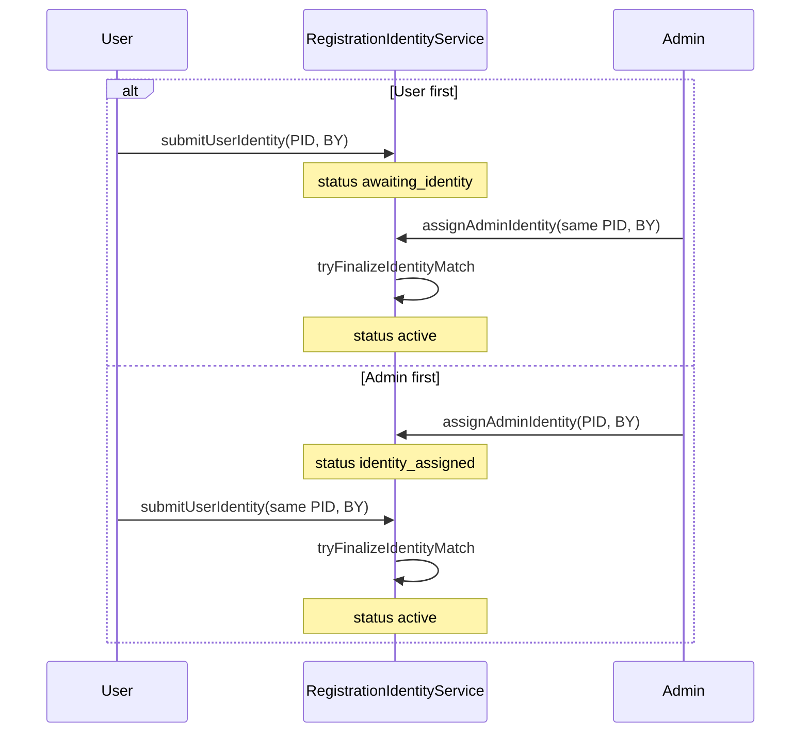

# Server Business Logic

Audience: backend developers and agents working in `server/`.

**Sources:** [`server/src/services/`](../../server/src/services/), [`server/prisma/schema.prisma`](../../server/prisma/schema.prisma), [`registrationHelpers.ts`](../../server/src/services/registrationHelpers.ts).

**Client UI mapping:** [`docs/client/ARCHITECTURE.md`](../client/ARCHITECTURE.md)

---

## Tournament model

| Division | `scoring_mode` | Routes | Features |
|----------|----------------|--------|----------|
| Boys | `football` | `/api/teams`, `/api/matches`, `/api/stats`, … | Matches, goals, bracket, 5 outfield + 1 GK lineup |
| Girls | `points` | `/api/teams-girls`, `/api/stats-girls`, `/api/news-girls`, … | `PointEntryService`, no matches/goals/bracket |

Each active season is scoped by `(year_month, division)`. Middleware `setGirlsDivision` sets division context on `-girls` route mirrors.

---

## Two-layer registration

| Layer | Purpose | Tables / APIs |
|-------|---------|---------------|
| **1. Website** | Login, browse | `users`; `/api/auth/*` |
| **2. Tournament** | Per-season play eligibility | `season_registrations`, workflow requests; `/api/users/registration`, `/api/users/verify-identity`, `/api/teams/*/join-request`, admin workflows |

One `users` row; one `season_registrations` row per `(user_id, season_id)`.

---

## Identity gate (Jun 2026)

Replaced invoice/redeem with **personal ID (תעודת זהות) + birth year**. Symmetric flow:

1. User **or** admin enters PID + birth year first.
2. Other side enters matching values.
3. `active` only when encrypted ID and birth year match on both columns.

**Storage:** AES-256-GCM ciphertext (`userPersonalIdEnc`, `adminPersonalIdEnc`); birth years in plain `Int`. Admin APIs return **masked** user ID (last 4 digits) only. User-facing APIs never return full PID.

**Legacy:** `invoice_codes` table retained for historical rows; new registrations do not write to it. Column `invoiceAlert` stores Hebrew mismatch text (name unchanged).

### Form preregistration (Google Form CSV — Jun 2026)

Offline team-registration CSV is parsed and imported into `form_prereg_entries` (per `season_id`):

| Step | Command |
|------|---------|
| Migrate | `npm run db:migrate` in `server/` |
| Import | `npm run import:prereg` — replace-all for active boys season (or `--season-id`) |
| Debug JSON | `npm run parse:prereg` — optional local inspection in `data/preregistration/` (gitignored) |

Requires `DATABASE_URL` and `PERSONAL_ID_KEY` on import host (same key as API). Personal IDs stored encrypted (`personal_id_enc`); birth years plain `Int`. Captain team email optional (`captain_email` only).

**Runtime:** `PreregistrationLookupService.evaluate(seasonId, personalId, birthYear)` — activation only on **both** fields matching a complete form row. Partial form data or single-field mismatch → Hebrew alert email to the **logged-in user's** account email (not CSV email).

Prereg lookup is wrapped in try/catch; failures never block registration.

---

## Status machine

From `SeasonRegistrationStatus` in schema:

| Status | Meaning |
|--------|---------|
| `none` | No identity submitted this season |
| `join_pending` | Join or creation request in flight |
| `awaiting_identity` | User submitted PID+BY; admin has not assigned |
| `identity_assigned` | Admin assigned; user must match |
| `active` | Identity matched — join/create allowed |
| `archived` | Season ended |

Typical flow: `none` → (`awaiting_identity` \| `identity_assigned`) → `active` → optional `join_pending` during workflow → back to `active` or `archived`.

---

## Workflow requests

| Table | Purpose |
|-------|---------|
| `team_join_requests` | User requests roster slot |
| `team_creation_requests` | User requests new team |
| `team_transfer_requests` | Rostered player moves teams |

**Rules:**

- **One pending request** per user per season (join **or** creation, not both).
- Join/creation approval requires `active` + matched identity.
- **Owner review** on join: team **owner** (`ownerUserId`) approves first (`owner_approved`), then admin final approve. Squad captains edit squad roles only (with owner).
- Transfers: admin approval only (unchanged).

---

## Division lock

`users.active_division` set on first workflow action on a side.

| Helper | Role |
|--------|------|
| `lockActiveDivision(userId, division)` | Sets division on first boys/girls action |
| `assertDivisionAccess(userId, division)` | Blocks cross-division API calls |

Cannot assign boys identity to user locked to girls division.

---

## Service map

| Service | Key methods / owns |
|---------|-------------------|
| `RegistrationService` | Facade over query/workflow/identity |
| `RegistrationQueryService` | `getRegistrationSummary` (incl. `ownerPendingJoinCount`), team list, admin user search |
| `RegistrationWorkflowService` | Join/creation/transfer requests, squad roles, admin queues, `assertFootballLineup` |
| `RegistrationIdentityService` | `submitUserIdentity`, `assignAdminIdentity`, `tryFinalizeIdentityMatch`, `assertMatchedIdentityForApproval` |
| `IdentityRateLimitService` | 3 failed attempts/day per user+season; Redis `rt:identity:attempts:{userId}:{seasonId}` |
| `AuthRateLimitService` | Login/register/verify throttles |
| `TeamRosterService` | Admin roster mutations (Prisma) |
| `TeamDataService` | Cached public team documents |
| `PlayerService` | Avatar sync, voluntary leave |
| `SeasonService` / `AdminSeasonService` | Active season, girls season admin |
| `AdminUserService` | Platform admin role search and promotion |
| `MatchDataService` / `StatsService` / `PlayoffService` | Fixtures, standings, playoffs |
| `NewsDataService` | Division-scoped news |
| `PointsStatsService` / `PointEntryService` | Girls points tournament |
| `CacheService` | Redis read-through cache (`rt:` keys) |
| `FootballDataService` | World Cup proxy (optional) |

Controllers stay thin: validate input, call owning service, map errors to HTTP.

---

## Authorization matrix

| Action | Anonymous | User | Captain (owner) | Platform admin |
|--------|-----------|------|-----------------|----------------|
| Public reads (teams, stats, news) | Yes | Yes | Yes | Yes |
| Verify identity / registration | — | Own user | Own user | — |
| Join/create/transfer request | — | Own user (`active`) | Own user | Own user |
| Owner join review | — | — | Own team | — |
| Roster add/delete/move | — | — | — | Yes |
| Admin workflows / identity assign | — | — | — | Yes |
| Match/news CRUD | — | — | — | Yes |

JWT role checked on each request; demoted admin must re-login for stale JWT (DB is authoritative).

---

## Rate limits and Redis

| Service | Limit | Key pattern |
|---------|-------|-------------|
| `IdentityRateLimitService` | 3 failed identity submissions/day (Jerusalem midnight) | `rt:identity:attempts:{userId}:{seasonId}` |
| `AuthRateLimitService` | Login 10/15m, register 5/h, verify 5/15m | Auth route prefixes |
| `CacheService` | Read-through TTL | `rt:doc:*`, division-scoped keys |

In-memory fallback when `REDIS_URL` unset (local dev only).

---

## PII and security

- `PERSONAL_ID_KEY` — 32-byte base64; AES-256-GCM for `personal_id_enc` columns.
- Admin workflow: masked user ID + birth year in JSON; full admin PID never returned.
- httpOnly cookies: `rt_session` (user), `rt_player` (player zone).
- Origin CSRF guard on mutating routes; `CORS_ORIGINS` env.

See [`context.md`](../../context.md) threat-model paragraph under Current Focus.

---

## Football-specific rules

- Lineup: 5 outfield + 1 goalkeeper (`assertFootballLineup` in `RegistrationWorkflowService`).
- Playoffs: `PlayoffService` sync from standings; admin trigger `POST /api/matches/sync-playoffs`.

---

## Girls-specific rules

- Standings from `point_entries` via `PointsStatsService`.
- No matches, goals, or bracket.
- Team MVP votes via `/api/votes-girls` (team-based, not player memberId).

---

## Removed legacy routes

| Removed | Replacement |
|---------|-------------|
| `POST /api/users/redeem-invoice` | `POST /api/users/verify-identity` |
| `POST /api/users/map-player` | `POST /api/teams/:id/join-request` |
| `POST /api/admin/users/invoice` | `POST /api/admin/users/identity` |
| `GET /api/admin/user-mappings` | Admin → סגל ורישום → `RegistrationWorkflowAdmin` |

---

## Related

- Full route catalog: [`API_REFERENCE.md`](API_REFERENCE.md)
- PRD §16: [`docs/product/PRD-database-schema.md`](../product/PRD-database-schema.md)
- Tests: root `npm run test` (66 tests: 11 shared + 55 server; mock API via `createTestApp`)
